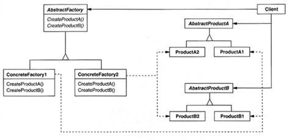

### 意图：
**提供一个创建一系列相关或相互依赖对象的接口，而无需指定它们具体的类 。**

### 别名：
Kit

### 结构： 


### 代码示例：
AbstractFactory类
```java
public abstract class AbstractFactory {  

    public abstract AbstractProductA createProductA();  

    public abstract AbstractProductB createProductB();  
}
```

ConcreteFactory类
```java
public class ConcreteFactory1 extends AbstractFactory {  

    @Override  
    public AbstractProductA createProductA() {  
        return new ProductA1();  
    }  
      
    @Override  
    public AbstractProductB createProductB() {  
        return new ProductB1();  
    }  
      
}  
      
public class ConcreteFactory2 extends AbstractFactory {  
      
    @Override  
    public AbstractProductA createProductA() {  
        return new ProductA2();  
    }  
      
    @Override  
    public AbstractProductB createProductB() {  
        return new ProductB2();  
    }  
      
}  
```

AbstractProduct类
```java
public abstract class AbstractProductA {  
}  
      
public abstract class AbstractProductB {  
}  
      
public class ProductA1 extends AbstractProductA {  
}  
      
public class ProductA2 extends AbstractProductA {  
}  
      
public class ProductB1 extends AbstractProductB {  
}  
      
public class ProductB2 extends AbstractProductB {  
}  
```

Client类
```java
public class Client {  
    public static void main(String[] args) {  
        AbstractFactory factory1 = new ConcreteFactory1();  
        AbstractFactory factory2 = new ConcreteFactory2();  
        AbstractProductA productA1 = factory1.createProductA();  
        AbstractProductA productA2 = factory2.createProductA();  
        AbstractProductB productB1 = factory1.createProductB();  
        AbstractProductB productB2 = factory2.createProductB();  
    }  
}  
```

### 缺点:
难以支持新种类的产品，解决这个缺点的方法很多。


### 适用性:
在以下情况可以使用Abstract Factory模式
<ul>
<li>一个系统要独立于它的产品的创建、组合和表示时。</li>
<li>一个系统要由多个产品系列中的一个来配置时。</li>
<li>当你要强调一系列相关的产品对象的设计以便进行联合使用时。</li>
<li>当你提供一个产品类库，而只想显示它们的接口而不是实现时。</li>
</ul>

### 相关模式：
Abstract Factory类通常用工厂方法（Factory Method）实现，但它们也可以用Prototype实现。一个具体的工厂通常是一个单件（Singelton）。
