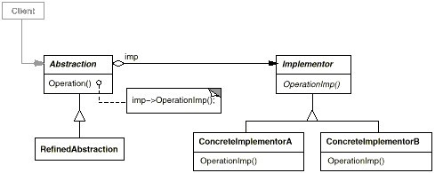

### 意图
将抽象部分与它的实现部分分离，使它们都可以独立地变化。

### 别名
Handle/Body

### 结构


参与者
<ul>
<li>Abstraction<br />
— 定义抽象类的接口。<br />
— 维护一个指向Implementor类型对象的指针。</li>
<li>RefinedAbstraction<br />
— 扩充由Abstraction定义的接口。</li>
<li>Implementor<br />
— 定义实现类的接口，该接口不一定要与Abstraction的接口完全一致；事实上这两个接口可以完全不同。一般来讲，Implementor接口仅提供基本操作，而Abstraction则定义了基于这些基本操作的较高层次的操作。</li>
<li>ConcreteImplementor<br />
— 实现Implementor接口并定义它的具体实现。</li>
</ul>
<br />

### 示例代码：
```java
public abstract class Abstraction {  
    private Implementor impl;  
  
    public Implementor getImpl() {  
        return impl;  
    }  
  
    public void setImpl(Implementor impl) {  
        this.impl = impl;  
    }  
  
    public Abstraction(Implementor impl) {  
        this.impl = impl;  
    }  
      
    public abstract void operation();  
}  
  
public class RefinedAbstraction extends Abstraction {  
  
    public RefinedAbstraction(Implementor impl) {  
        super(impl);  
    }  
  
    @Override  
    public void operation() {  
        getImpl().operation();  
    }  
  
}  
  
public interface Implementor {  
  
    public void operation();  
}  
  
public class ConcreteImplementorA implements Implementor {  
  
    @Override  
    public void operation() {  
        System.out.println("do something");  
    }  
  
}  
  
public class Client {  
  
    public static void main(String[] args) {  
        Abstraction abstraction =
            new RefinedAbstraction(new ConcreteImplementorA());  
        abstraction.operation();  
    }  
}
```

### 适用性

* 你不希望在抽象和它的实现部分之间有一个固定的绑定关系。例如这种情况可能是因为，在程序运行时刻实现部分应可以被选择或者切换。
* 类的抽象以及它的实现都应该可以通过生成子类的方法加以扩充。这时Bridge模式使你可以对不同的抽象接口和实现部分进行组合，并分别对它们进行扩充。
* 对一个抽象的实现部分的修改应对客户不产生影响，即客户的代码不必重新编译。
* 你想在多个对象间共享实现（可能使用引用计数），但同时要求客户并不知道这一点。


### 效果

分离了接口和具体的实现，将Abstraction与Implementor分离有助于降低对实现部分编译时刻的依赖性，当改变一个实现类时，并不需要重新编译Abstraction类和它的客户程序，甚至可以在运行时刻改变。大大提高了扩展性，Abstraction和Implementor都可以各自独立扩展。

注意：如果Implementor仅有一个实现时候，就不要用该模式了（当然示例代码是用来给个例子的）。

### 相关模式

Abstract Factory模式可以用来创建和配置一个特定的Bridge模式。

Adapter模式用来帮助无关的类协同工作，它通常在系统设计完成后才会被使用。然而，Bridge模式则是在系统开始时就被使用，它使得抽象接口和实现部分可以独立进行改变。
