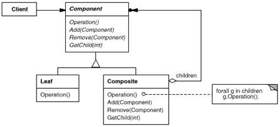

### 意图：

将对象组合成树形结构以表示“部分-整体”的层次结构。Composite使得用户对单个对象和组合对象的使用具有一致性。

### 结构：


参与者
<ul>
<li>
Component(Graphic)
<ul>
<li>为组合中的对象声明接口。</li>
<li>在适当的情况下，实现所有类共有接口的缺省行为。</li>
<li>(可选)在递归结构中定义一个接口，用于访问一个父部件，并在合适的情况下实现它。</li>
</ul>
</li>
<li>
Leaf(Rectangle、Line、Text等)
<ul>
<li>在组合中表示叶节点对象，叶节点没有子节点。</li>
<li>在组合中定义图元对象的行为。</li>
</ul>
</li>
<li>
Composite(Picture)
<ul>
<li>定义有子部件的那些部件的行为。</li>
<li>存储子部件。</li>
<li>在Component接口中实现与子部件有关的操作。</li>
</ul>
</li>
<li>
Client
<ul>
<li>通过Component接口操纵组合部件的对象。</li>
</ul>
</li>
</ul>

### 代码示例：
Component
```java
public interface Component {

	public void operation();
	
	public void add(Component item);
	
	void remove(Component item);
	
	public Component getChild(int i);
}
```

Composite
```java
public class Composite implements Component {
	
	private List<Component> children = new ArrayList<Component>();

	@Override
	public void operation() {
		for (Component child : children) {
			child.operation();
		}
	}

	@Override
	public void add(Component item) {
		this.children.add(item);
	}

	@Override
	public void remove(Component item) {
		this.children.remove(item);
	}

	@Override
	public Component getChild(int i) {
		return this.children.get(i);
	}

}
```

Leaf
```java
public class Leaf implements Component {

	@Override
	public void operation() {
		//do something
	}

	@Override
	public void add(Component item) {

	}

	@Override
	public void remove(Component item) {

	}

	@Override
	public Component getChild(int i) {
		return null;
	}

}
```

Client
```java
public class Client {

	public static void main(String[] args) {
		Component composite = new Composite();
		composite.add(new Leaf());
		composite.add(new Composite());
		composite.operation();
	}
}
```

### 适应：

* 你想表示对象的部分-整体层次结构。
* 你希望用户忽略组合对象与单个对象的不同，用户将统一地使用组合结构中的所有对象。


### 效果：

* 定义了包含基本对象和组合对象的类层次结构
* 简化客户代码
* 使得更容易增加新类型的组件
* 使你的设计变得更加一般化


### 相关模式：
通常部件-父部件连接用于Responsibility of Chain模式。

Decorator模式经常与Composite模式一起使用。当装饰和组合一起使用时，它们
通常有一个公共的父类。因此装饰必须支持具有Add、Remove和GetChild操作的Component接口。

Flyweight让你共享组件，但不再能引用他们的父部件。

Itertor可用来遍历Composite。

Visitor将本来应该分布在Composite和Leaf类中的操作和行为局部化。
