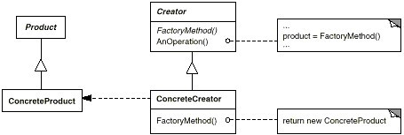

### 意图：

定义一个用于创建对象的接口，让子类决定实例化哪一个类。 Factory Method使一个类的实例化延迟到其子类。

### 别名：

虚构造器（Virtual Constructor）

### 结构： 


<ul>
<li>
Product<br />
— 定义工厂方法所创建的对象的接口。
</li>
<li>
ConcreteProduct<br />
— 实现Productt接口。
</li>
<li>
Creator<br />
— 声明工厂方法，该方法返回一个 Product类型的对象。Creator也可以定义一个工厂方法的缺省实现，它返回一个缺省的 ConcreteProduct对象。
</li>
<li>
ConcreteProduct对象<br/>
— 可以调用工厂方法以创建一个Product对象。
</li>
<li>
ConcreteCreator<br />
— 重定义工厂方法以返回一个ConcreteProduct实例。
</li>
</ul>
<br />

### 代码示例：
Creator类
```java
public abstract class Creator {  
      
    protected abstract Product factoryMethod();  
      
    public void anOperation() {  
        Product product = factoryMethod();  
        //do some thing  
    }  
}
```

ConcreteCreator类
```java
public class ConcreteCreator extends Creator {  
  
    @Override  
    protected Product factoryMethod() {  
        return new ConcreteProduct();  
    }  
  
}
```

### 问题：

可能仅为了创建适当的 Product对象而迫使你创建Creator子类。

### 适用性：

* 一个系统要独立于它的产品的创建、组合和表示时。
* 一个系统要由多个产品系列中的一个来配置时。
* 当你要强调一系列相关的产品对象的设计以便进行联合使用时。
* 当你提供一个产品类库，而只想显示它们的接口而不是实现时。


### 相关模式：

* Abstract Factory经常用工厂方法来实现；
* 工厂方法通常在Template Method中被调用；
* Prototype不需要创建Creator的子类。但是，它们通常要求一个针对Product类的Initialize操作。Creator使用Initialize来初始化对象。而Factory Method不需要这样的操作。

