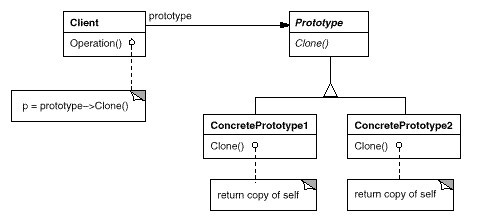

很少见到，我都没遇到过，或是遇到过也没注意。

### 意图：

用原型实例指定创建对象的种类，并且通过拷贝这些原型创建新的对象。

### 结构： 


<ul>
<li>
Prototype<br />
    ——声明一个克隆自身的接口
</li>
<li>
ConcretePrototype<br />
    ——实现一个克隆自身的操作
</li>
</ul>
<br />

### 示例代码:
```java
public abstract class Prototype implements Cloneable {  
  
    public Prototype clone() {  
        try {  
            return (Prototype) super.clone();  
        } catch (CloneNotSupportedException e) {  
            e.printStackTrace();  
        }  
        return null;  
    }  
      
    public abstract String getThing();  
}  
  
public class ConcretePrototype extends Prototype {  
  
    @Override  
    public String getThing() {  
        return "ConcretePrototype";  
    }  
  
}  
  
public class Client {  
  
    public static void main(String[] args) {  
        ConcretePrototype cp = new ConcretePrototype();  
        ConcretePrototype newCp = (ConcretePrototype) cp.clone();  
        System.out.println(newCp.getThing());  
    }  
}
```

### 效果：

这个是真的不需要new来创建对象了，或者说每次去请求新对象的时候都是去拷贝一个原有的对象的副本。听说clone的效率比new高。

### 问题：

克隆时构造函数不会被调用。

深克隆和浅克隆问题，比如JAVA中一个对象中其成员属性也是对象，单纯的clone操作不会克隆，结果是对象是新的，可是里面的内容的引用地址还是指向原有的。为此需要遍历然后挨个clone。如果遇到不支持克隆的成员，那就无能为力了。

适用：

当一个系统应该独立于它的产品创建、构成和表示时，要使用Prototype模式；以及

* 当要实例化的类是在运行时刻指定时，例如，通过动态装载；或者
* 为了避免创建一个与产品类层次平行的工厂类层次时；或者
* 当一个类的实例只能有几个不同状态组合中的一种时。建立相应数目的原型并克隆它们

可能比每次用合适的状态手工实例化该类更方便一些。

### 相关模式：

大量使用Composite和Decorator模式的设计通常可以从Prototype模式处获益。
