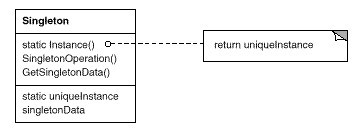

### 意图：

保证一个类仅有一个实例，并提供一个访问它的全局访问点。

### 结构图：


### 代码示例：
```java
public class Singleton {  
    private static Singleton instance = new Singleton();  
      
    private Singleton() {  
          
    }  
      
    public static Singleton getInstance() {  
        return instance;  
    }  
      
    public void test() {  
        System.out.println("Singleton test");  
    }  
      
    public static void main(String[] args) {  
        Singleton s = Singleton.getInstance();  
        s.test();  
    }  
}
```

### 效果：

因为Singleton类封装它的唯一实例，所以它可以严格的控制。

### 注意：

Singleton不是说只能唯一，也可以控制其实例的数量，对多个实例的创建和控制。

Singleton类可以有子类，而且用这个扩展类的实例来配置一个应用是很容易的。你可以用你所需要的类的实例在运行时刻配置应用。

### 实现：

保证一个唯一的实例是该模式的重点，不同语言对此有不同的方法。面对语言特性，还需要注意并发同步等问题。

### 相关模式：

Abstract Factory、Builder、Prototype都可以用Singleton实现。
